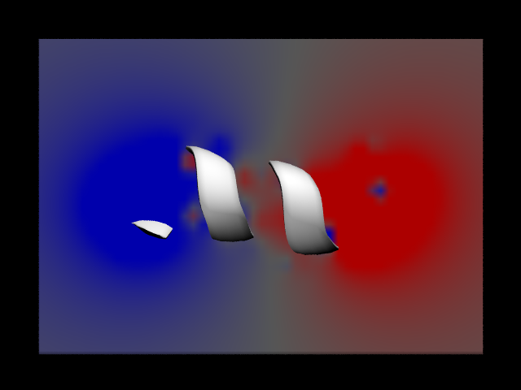
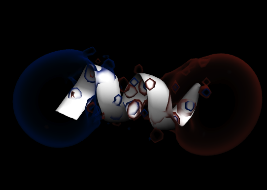

# EletroGrid
Calcula o potencial eletrostático no entorno de uma molécula  
http://lmdm.biof.ufrj.br/software/eletrogrid/index.html

## Autoria
Diego Enry B. Gomes, Raphael Mazzine, Pedro G. Pascutti
Universidade Federal do Rio de Janeiro, Rio de Janeiro, RJ – Brasil.
Support: diego@biof.ufrj.br

## Descrição
* O programa EletroGrid calcula o potencial eletrostático em uma carga de prova, pela lei de Coulomb, em uma rede de pontos no espaço no entorno de uma molécula.
* O EletroGrid escreve os valores do potencial um arquivo no format .dx. O potencial no espaço pode ser lido em programas de visualização de estruturas como PyMOL e VMD.
* EletroGrid é distribuído com seu código fonte (Fortran 95) e arquivos de exemplo:

  
  
  

## Demonstração de uso
O programa EletroGrid requer um arquivo de entrada no formato .PQR (PDB com cargas). O nome do arquivo de entrada, o espaçamento dos pontos da rede e a distancia entre os átomos e as fronteiras da rede devem ser modificados no código fonte antes da compilação.

Visualização da potencial eletrostático calculado para um hélice-alfa composta de 10 resíduos do aminoácio alanina (uma deca-alanina).
Esquerda: A hélice nativa, representada pelo modelo de cartoon 
Centro: O potencial eletrostático no plano passando pelo centro do eixo longitudinal da hélice-alfa.
Direita: a isosuperfície de potencial no espaço.
As imagens foram renderizadas com o programa VMD
